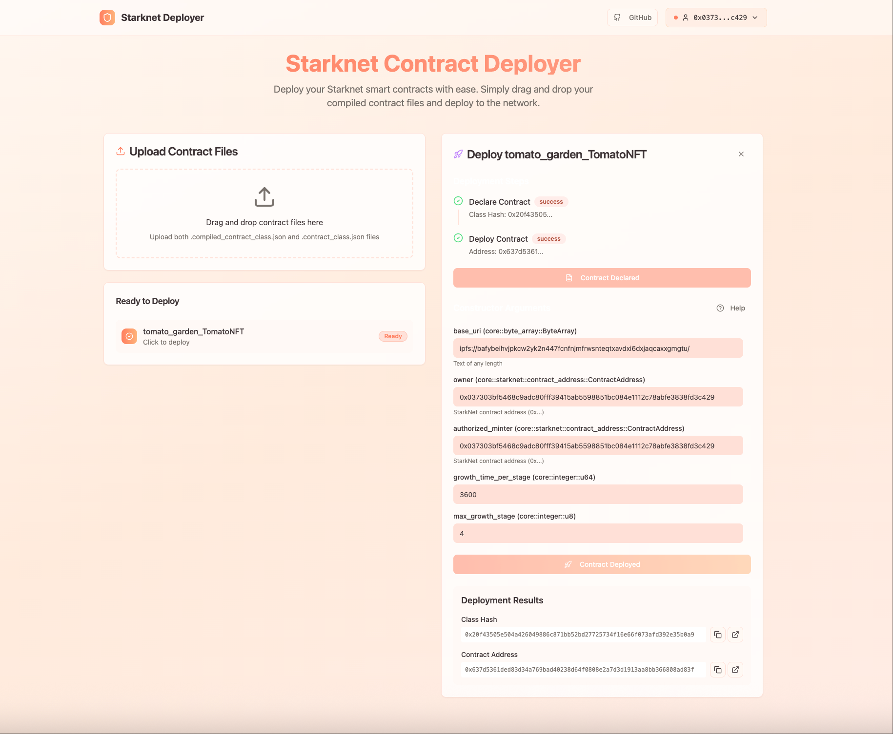

# StarkNet Contract Launcher 🚀



A modern, user-friendly web application for deploying smart contracts on the StarkNet blockchain. Built with React, TypeScript, and StarkNet.js, this tool simplifies the contract deployment process with an intuitive drag-and-drop interface and intelligent data conversion.

## ✨ Features

### 🔗 Wallet Integration
- **Multi-wallet support**: Argent, Braavos, and OKX Wallet
- **Auto-connect**: Seamless wallet connection with StarkNetKit
- **Network support**: StarkNet Sepolia testnet (configurable for mainnet)

### 📁 Smart Contract Management
- **Drag & Drop Upload**: Easy file upload for compiled contracts
- **Dual File Support**: Handles both Sierra (.contract_class.json) and CASM (.compiled_contract_class.json) files
- **ABI Parsing**: Automatic extraction and parsing of contract ABIs
- **Contract Validation**: Ensures both required files are present before deployment

### 🛠 Intelligent Deployment
- **Two-Step Process**: Separate declare and deploy operations
- **Real-time Status**: Live deployment progress tracking
- **Error Handling**: Comprehensive error messages and recovery suggestions
- **Transaction Monitoring**: Automatic transaction confirmation waiting

### 🎯 Advanced Data Conversion
- **Type-Aware Input**: Intelligent parameter conversion based on Cairo types
- **Multiple Format Support**:
  - **Numbers**: Decimal (123) and hexadecimal (0x1a2b) formats
  - **Booleans**: true/false or 1/0
  - **Strings**: Short strings (≤31 chars) and long strings (ByteArray)
  - **Arrays**: JSON format [1,2,3] or comma-separated 1,2,3
  - **Addresses**: StarkNet and Ethereum address formats
  - **Large Numbers**: u256, u512 with proper encoding
- **Input Validation**: Real-time validation with helpful error messages
- **Interactive Help**: Built-in data format guide and examples

### 🎨 Modern UI/UX
- **Responsive Design**: Works seamlessly on desktop and mobile
- **Dark Theme**: Modern dark interface with gradient backgrounds
- **Interactive Components**: Smooth animations and transitions
- **Toast Notifications**: Real-time feedback for all operations
- **Collapsible Help**: Context-sensitive help sections

## 🚀 Quick Start

### Prerequisites
- Node.js 18+ or Bun
- A StarkNet wallet (Argent, Braavos, or OKX)
- Compiled StarkNet contracts (.contract_class.json and .compiled_contract_class.json files)

### Installation

1. **Clone the repository**
   ```bash
   git clone https://github.com/your-username/starknet-contract-launcher.git
   cd starknet-contract-launcher
   ```

2. **Install dependencies**
   ```bash
   npm install
   # or
   bun install
   ```

3. **Start the development server**
   ```bash
   npm run dev
   # or
   bun dev
   ```

4. **Open your browser**
   Navigate to `http://localhost:8080`

### Building for Production

```bash
npm run build
# or
bun run build
```

The built files will be in the `dist` directory.

## 📖 Usage Guide

### 1. Connect Your Wallet
- Click the "Connect Wallet" button in the header
- Select your preferred wallet from the modal
- Approve the connection in your wallet extension

### 2. Upload Contract Files
- Drag and drop your compiled contract files into the upload area
- Or click to browse and select files
- You need both files for each contract:
  - `contract_name.contract_class.json` (Sierra compiled contract)
  - `contract_name.compiled_contract_class.json` (CASM compiled contract)

### 3. Deploy Your Contract

#### Step 1: Declare Contract
- Select a contract from the "Ready to Deploy" list
- Click "Declare Contract" to register the contract class on StarkNet
- Wait for the transaction to be confirmed

#### Step 2: Deploy Contract Instance
- After successful declaration, the "Deploy Contract" button becomes available
- Fill in constructor parameters if required:
  - Use the help guide for proper data formatting
  - Each parameter shows its expected Cairo type
  - Input validation provides real-time feedback
- Click "Deploy Contract" to create a contract instance
- Wait for deployment confirmation

### 4. Constructor Parameter Formats

The application automatically converts your input based on the Cairo parameter type:

| Cairo Type | Input Format | Examples |
|------------|--------------|----------|
| `felt252`, `u8`-`u128` | Numbers (decimal/hex) | `123`, `0x1a2b` |
| `bool` | Boolean values | `true`, `false`, `1`, `0` |
| `u256` | Large numbers | `123456789`, `0x1a2b3c4d` |
| `ContractAddress` | StarkNet addresses | `0x1234...abcd` |
| `bytes31` | Short strings | `"Hello"` (max 31 chars) |
| `ByteArray` | Long strings | `"Any length text"` |
| `Array<T>` | Arrays | `[1,2,3]` or `1,2,3` |

## 🏗 Architecture

### Tech Stack
- **Frontend**: React 18 + TypeScript
- **Styling**: Tailwind CSS + shadcn/ui components
- **StarkNet Integration**: StarkNet.js v6.11.0
- **Wallet Connection**: StarkNetKit
- **State Management**: React hooks
- **Build Tool**: Vite
- **Package Manager**: npm/bun

### Project Structure
```
src/
├── components/          # React components
│   ├── ui/             # shadcn/ui components
│   ├── Header.tsx      # Wallet connection header
│   ├── FileUpload.tsx  # Contract file upload
│   └── DeploymentPanel.tsx # Contract deployment interface
├── utils/              # Utility functions
│   └── starknet.ts     # StarkNet operations & data conversion
├── types/              # TypeScript type definitions
├── hooks/              # Custom React hooks
└── pages/              # Application pages
```

### Key Components

#### Data Conversion Engine (`src/utils/starknet.ts`)
- **`convertInputToStarknetFormat()`**: Converts user input to StarkNet-compatible format
- **`convertConstructorArgs()`**: Batch converts constructor arguments
- **`declareContract()`**: Handles contract declaration
- **`deployContract()`**: Manages contract deployment with proper calldata compilation

#### Deployment Panel (`src/components/DeploymentPanel.tsx`)
- Interactive deployment interface
- Real-time parameter validation
- Step-by-step deployment progress
- Context-sensitive help system

#### File Upload (`src/components/FileUpload.tsx`)
- Drag-and-drop file handling
- Contract file validation
- ABI extraction and parsing
- Contract pairing logic

## 🔧 Configuration

### Network Configuration
Edit `src/components/StarknetProvider.tsx` to change networks:

```typescript
// Current: Sepolia testnet only
chains={[sepolia]}

// For mainnet support:
chains={[mainnet, sepolia]}
```

### RPC Endpoints
The application uses public RPC endpoints by default. For production, consider using dedicated endpoints:

```typescript
provider={jsonRpcProvider({
  rpc: (chain: Chain) => {
    switch (chain) {
      case mainnet:
        return { nodeUrl: 'YOUR_MAINNET_RPC_URL' };
      case sepolia:
      default:
        return { nodeUrl: 'YOUR_SEPOLIA_RPC_URL' };
    }
  }
})}
```

## 🧪 Development

### Available Scripts
- `npm run dev` - Start development server
- `npm run build` - Build for production
- `npm run build:dev` - Build in development mode
- `npm run lint` - Run ESLint
- `npm run preview` - Preview production build

### Adding New Cairo Types
To support additional Cairo types, extend the `convertInputToStarknetFormat()` function in `src/utils/starknet.ts`:

```typescript
// Add new type handling
if (normalizedType === 'your_new_type') {
  return convertYourNewType(trimmedValue);
}
```

## 🤝 Contributing

1. Fork the repository
2. Create a feature branch (`git checkout -b feature/amazing-feature`)
3. Commit your changes (`git commit -m 'Add amazing feature'`)
4. Push to the branch (`git push origin feature/amazing-feature`)
5. Open a Pull Request

## 📝 License

This project is licensed under the MIT License - see the [LICENSE](LICENSE) file for details.

## 🙏 Acknowledgments

- [StarkNet](https://starknet.io/) - The blockchain platform
- [StarkNet.js](https://starknetjs.com/) - JavaScript library for StarkNet
- [StarkNetKit](https://github.com/starknet-io/starknetkit) - Wallet connection library
- [shadcn/ui](https://ui.shadcn.com/) - UI component library
- [Tailwind CSS](https://tailwindcss.com/) - Utility-first CSS framework

## 🐛 Known Issues & Troubleshooting

### Common Issues

1. **"Failed to declare contract" Error**
   - Ensure both Sierra and CASM files are uploaded
   - Check that your wallet has sufficient ETH for gas fees
   - Verify you're connected to the correct network

2. **Parameter Conversion Errors**
   - Use the help guide for proper input formatting
   - Check that array elements match the expected type
   - Ensure addresses are properly formatted with 0x prefix

3. **Wallet Connection Issues**
   - Make sure your wallet extension is installed and unlocked
   - Try refreshing the page and reconnecting
   - Check that your wallet supports StarkNet

### Data Conversion Examples

Here are some examples of proper parameter formatting:

```typescript
// Numbers (felt252, u8, u16, u32, u64, u128)
"123"           // Decimal
"0x1a2b"       // Hexadecimal

// Boolean
"true"          // Boolean true
"false"         // Boolean false
"1"             // Numeric true
"0"             // Numeric false

// u256 (large numbers)
"123456789012345678901234567890"
"0x1a2b3c4d5e6f7890abcdef"

// Addresses
"0x049d36570d4e46f48e99674bd3fcc84644ddd6b96f7c741b1562b82f9e004dc7"

// Short strings (bytes31, max 31 characters)
"Hello World"
"TOKEN_SYMBOL"

// Long strings (ByteArray)
"This is a very long string that can contain more than 31 characters and will be properly encoded as a ByteArray"

// Arrays
"[1,2,3,4,5]"           // JSON format
"1,2,3,4,5"             // Comma-separated
"[0x1a,0x2b,0x3c]"      // Hex values in array
```

### Getting Help
- Check the browser console for detailed error messages
- Use the built-in help system for parameter formatting guidance
- Refer to the [StarkNet.js documentation](https://starknetjs.com/docs/guides/define_call_message) for advanced data conversion
- Join the [StarkNet Discord](https://discord.gg/starknet) for community support

### Performance Tips
- Use dedicated RPC endpoints for better performance in production
- Consider batching multiple contract deployments
- Monitor gas fees and deploy during lower network congestion

---

Built with ❤️ for the StarkNet ecosystem

## 🔗 Useful Links

- [StarkNet Documentation](https://docs.starknet.io/)
- [StarkNet.js Documentation](https://starknetjs.com/)
- [Cairo Language Documentation](https://cairo-lang.org/)
- [StarkNet Ecosystem](https://www.starknet-ecosystem.com/)
- [Argent Wallet](https://www.argent.xyz/)
- [Braavos Wallet](https://braavos.app/)
